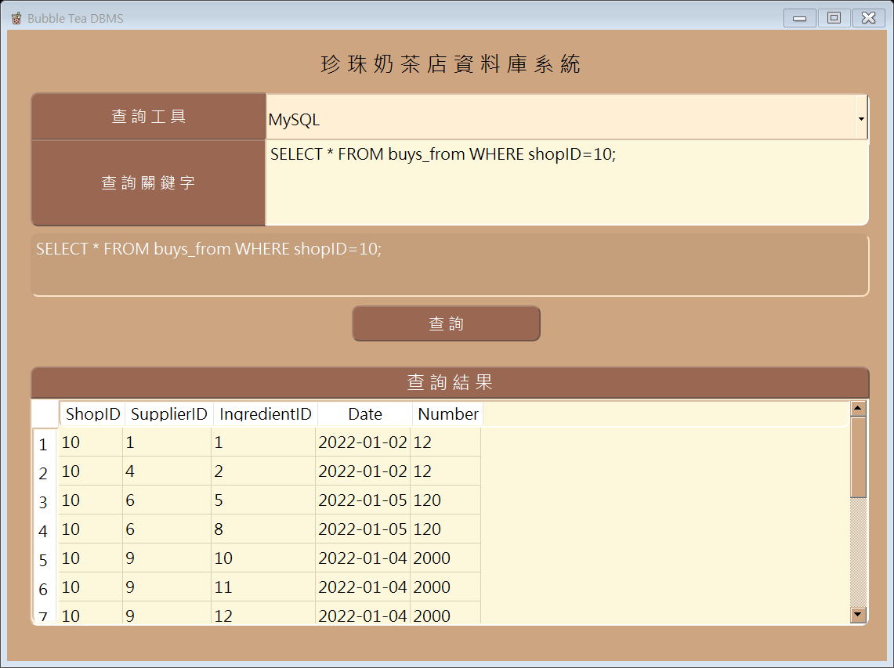

# Database Management System - Final Project
**Author:** Pei-Cheng, Li (h24074085@gs.ncku.edu.tw)

## Introduction
110-2 NCKU DBMS Final Project  
The database system of the bubble tea shop, the goal:
1. Basic information management of each branch
2. Basic information management of employees in each branch
3. Management of raw materials and exhibition materials of each branch
4. Management of sales data of products in each branch

## Getting started
### System Architecture and Environment
#### Architecture

#### Requirements
* OS: Windows 10
* GUI: Python 3.8   
You can install all the required packages using the following command: 

        pip install -r requirements.txt

* Database: MySQL 8.0  
You can import DB using the following command (You can set the database name yourself):

        mysql -u root -p {database_name} < dbms_project.sql

### Screenshots of the Interface and Instructions for use
#### GUI
* Query tool (two modes):  
  1. Button: SQL commands that have been set (`SELECT-FROM-WHERE`, `DELETE`, `INSERT`, `UPDATE`, `IN`, `NOT IN`, `EXISTS`, `NOT EXISTS`, `COUNT`, `SUM`, `MAX`, `MIN`, `AVG`, `HAVING`).
  2. Query: Enter SQL commands (MySQL) by yourself.
* Query keyword: When the query tool is set to MySQL, enter the SQL command by yourself.
* Query (button): Accept the command and execute the query.
* Query results: Display the query results.

You can execute the GUI using the following command:   
`-u`: the username of the database  
`-p`: the password of the database  
`-db`: the name of the database

        python main.py -u '<db_user>' -p '<db_password>' -db '<db_name>'

#### Button Demonstration
* Steps:
  1. Select the SQL command you want to execute from the query tool.
  2. The SQL command to be executed appears (white text between the query keyword and the query button).
  3. Click the query button.
  4. Display query results.

#### Query Demonstration
* Steps:
  1. The query tool selects MySQL.
  2. Enter the SQL command in the light-colored space of the query keyword, and the entered SQL command (white text between the query keyword and the query button) will appear simultaneously.
  3. Click the query button.
  4. Display query results.

p.s.  
1. Execute the three SQL commands of `DELETE`, `INSERT` and `UPDATE`, and the window below will pop up. After closing the window, all the data of the Table will be displayed.

2. When the SQL command is entered incorrectly or no data to display can be found, the window below will pop up, please check or re-enter the SQL command.  

### Database Design
#### ER diagram
* Entity
  * shop has 4 attributes: ID (unique), Name, Location, Phone
  * employee has 5 attributes: ID (unique), Name, Phone, Salary, Position (position)
  * tea has 3 attributes: ID (unique), Name, Price
  * supplier has 4 attributes: ID (unique), Name, Location, Phone
  * ingredient has 3 attributes: ID (unique), Name and Price
  * er_person (emergency contact person) has 4 attributes: ID (unique), Name, Phone, Relationship
* Relationship
  * Each shop must be managed by an employee
  * Each employee can only work in one shop
  * One supervisor in the employee is responsible for supervising multiple supervisors
  * Every employee must have at least one er_person
  * Each shop sells tea, but the tea sold by each shop may not be the same, and need to record Date, Number
  * Every shop buys ingredients from supplier, and need to record Date, Number

#### Relational Schema
* Illustrate:
  * Each Entity becomes a Table and treats attributes as columns
  * EID of er_person Table: ID of employee Table, which records each employee's emergency contact
  * sells Table is the sales record, ShopID: ID of shop Table, TeaID: ID of tea Table, Date: Sales date, Number: Sales quantity
  * buys_from Table is the purchase record, ShopID: shop Table ID, SupplierID: supplier Table ID, IngredientID: ingredient Table ID, Date: Purchase date, Number: Purchase quantity
  * ManageEID of the shop Table: ID of the employee Table, which records which employee manages each shop
  * SuperEID of employee Table: ID of employee Table, which records each employee's boss
  * WorkSID of the employee Table: The ID of the shop Table, which records which shop each employee works in

